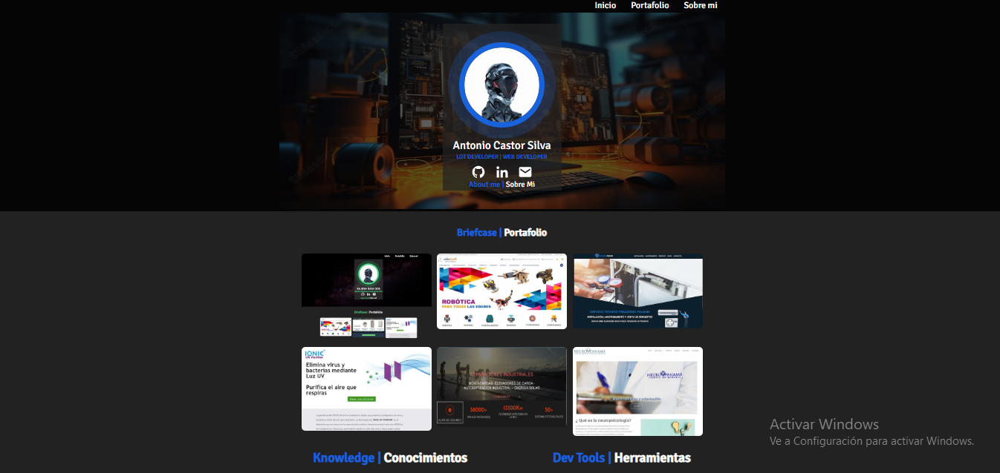

# 🌐 Portafolio Web — Antonio Castor Silva

## Frontend Developer Jr

Portafolio profesional desarrollado para mostrar mis habilidades como desarrollador frontend, proyectos reales y experiencia con herramientas modernas de optimización y deployment.

Este proyecto fue construido aplicando buenas prácticas de desarrollo moderno, bundling de assets, optimización de rendimiento y despliegue en GitHub Pages.

---

## 🚀 Demo en vivo

🔗 https://antoniokazthor12345.github.io/PortafolioWeb/

---

## 🛠 Tecnologías utilizadas

### Frontend
- HTML5
- CSS3
- JavaScript ES6+

### Build Tools
- Webpack
- npm
- Babel

### Control de versiones
- Git
- GitHub

---

## ⚡ Características

✅ Diseño responsive  
✅ Optimización de imágenes y assets  
✅ Bundling y minificación de código  
✅ CSS modularizado  
✅ JavaScript optimizado para producción  
✅ Deploy automático con GitHub Pages  

---

## 📂 Estructura del proyecto

```bash
PortafolioWeb/
│
├── src/
├── assets/
├── dist/
├── index.html
├── index.js
├── package.json
├── webpack.config.js
└── README.md
```

---

## 📦 Instalación local

Clonar repositorio:

```bash
git clone https://github.com/antoniokazthor12345/PortafolioWeb.git
```

Instalar dependencias:

```bash
npm install
```

Ejecutar en desarrollo:

```bash
npm run dev
```

Compilar producción:

```bash
npm run build
```

---

## 🎯 Objetivo del proyecto

Diseñar una marca personal sólida como desarrollador frontend, aplicando herramientas profesionales utilizadas en entornos reales de desarrollo.

---

## 📫 Contacto

📧 Tu correo aquí  
💻 GitHub: https://github.com/antoniokazthor12345  
🌐 Portfolio: https://antoniokazthor12345.github.io/PortafolioWeb/  
💼 LinkedIn: https://www.linkedin.com/in/antonio-kazthor-443413245

---

## © Autor

Antonio Castor Silva
